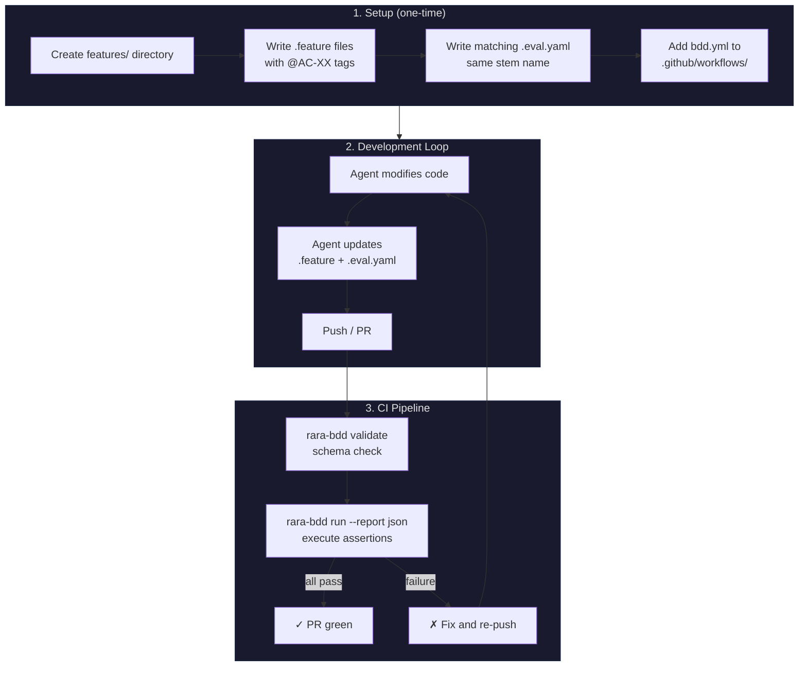
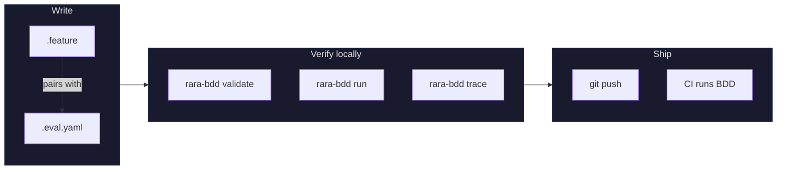
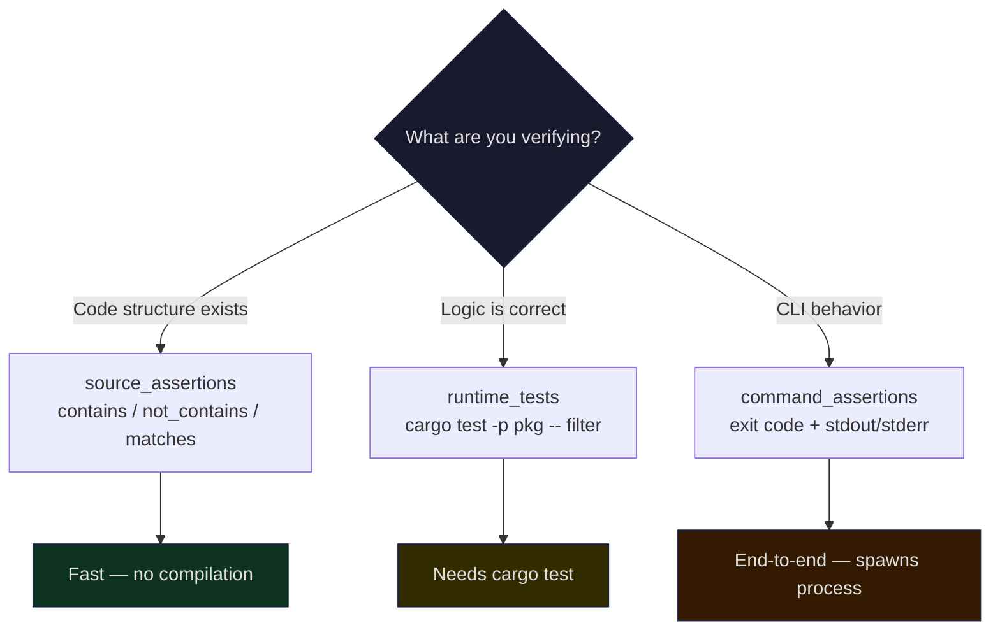

# Integration Guide

## Overview



## Step 1: Create Feature Specs

```
my-project/
├── features/
│   ├── api.feature           # Gherkin scenarios
│   ├── api.eval.yaml         # Eval config (same stem)
│   ├── cli.feature
│   ├── cli.eval.yaml
│   └── TRACEABILITY.md       # Auto-generated
├── .github/workflows/
│   └── bdd.yml               # CI workflow
└── src/
```

### .feature file

```gherkin
@auth
Feature: Authentication
  @AC-01
  Scenario: AC-01 Login function exists
    Given the auth module
    When I inspect the public API
    Then a login function is exported
```

- Each scenario MUST have an `@AC-XX` tag (numeric)
- Scenario name SHOULD start with the AC ID
- Without `@AC-XX`, gets auto-ID `UNTAGGED-scenario-name`

### .eval.yaml file

Must share the same stem as the `.feature` (`auth.feature` → `auth.eval.yaml`):

```yaml
AC-01:
  description: "Login function exists"
  source_assertions:
    - file: src/auth.rs
      contains: ["pub fn login"]
```

See [eval-dsl.md](eval-dsl.md) for full field reference.

## Step 2: Add CI Workflow

```yaml
# .github/workflows/bdd.yml
name: BDD
on:
  push:
    branches: ["main"]
  pull_request:
    branches: ["main"]

jobs:
  bdd:
    name: BDD Suite
    runs-on: ubuntu-latest
    steps:
      - uses: actions/checkout@v4
      - uses: dtolnay/rust-toolchain@stable
      - name: Install rara-bdd
        run: cargo install --git https://github.com/rararulab/rara-bdd --locked
      - run: rara-bdd validate --features-dir features
      - run: rara-bdd run --features-dir features --report json
```

## Step 3: Develop



```bash
# Local workflow
rara-bdd validate --features-dir features   # catch YAML typos
rara-bdd run --features-dir features        # run assertions
rara-bdd run --filter AC-01                 # run one AC
rara-bdd trace --features-dir features      # update TRACEABILITY.md
```

## Assertion Strategy



| Type | Speed | Use when |
|------|-------|----------|
| `source_assertions` | Instant | Checking types, patterns, imports exist |
| `runtime_tests` | Seconds | Verifying logic via cargo test |
| `command_assertions` | Seconds | Testing CLI output end-to-end |

## Error Messages

```
AC-01: source assertion failed — 'src/auth.rs' missing expected pattern: pub fn login
AC-02: runtime test failed — cargo test -p auth-service -- test_login failed (exit 101)
AC-03: command assertion failed — stdout of 'cargo run -- list' missing pattern: "ok":true
AC-05: no eval config found
```

JSON errors include `suggestion` for agent self-correction:

```json
{"ok": false, "error": "features directory not found: /bad/path", "suggestion": "check --help for usage"}
```
